<!--START_SECTION:badges-->
 
<!--END_SECTION:badges-->

<!--START_SECTION:hero-->
<h1 align="center">👋 Daichi Okumura</h1>

<strong>@dahutos2</strong>

<a href="https://x.com/dahutos1">X / Twitter</a>

Full-stack developer / Flutter etc…

📍 Osaka

<!--END_SECTION:hero-->

## 🛠 Tech Stack
<!--START_SECTION:stack-->
### Advanced

 

### Beginner

      
<!--END_SECTION:stack-->

## 📊 Stats & Streak
<!--START_SECTION:stats-->

 

 
<!--END_SECTION:stats-->

## ⌛ Coding Activity (Year-to-date)
<!--START_SECTION:contrib-->

<!--END_SECTION:contrib-->

## ✨ LAPRAS Score
<!--START_SECTION:lapras-card-->

<!--END_SECTION:lapras-card-->

## 🏆 Achievements
<!--START_SECTION:trophy-->

<!--END_SECTION:trophy-->

<!--START_SECTION:footer-->

⏰ Updated 2025-07-03 00:00 JST

<!--END_SECTION:footer-->
